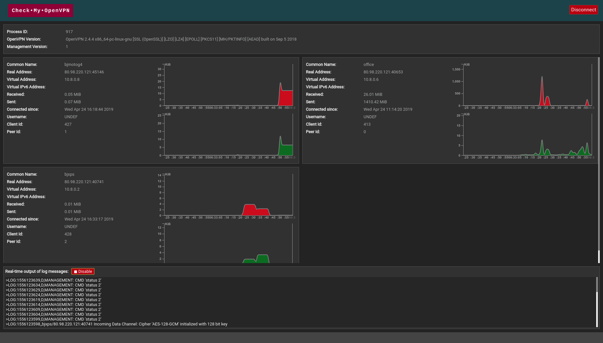

# CheckMyOpenVPN

## Description

CheckMyOpenVPN is a cross platform desktop application to remotely control your OpenVPN daemon.

## Usage

- You should enable the management interface in the OpenVPN configuration file:
  [OpenVPN Management Interface Notes](https://openvpn.net/community-resources/management-interface/)
- Connect to the management port
